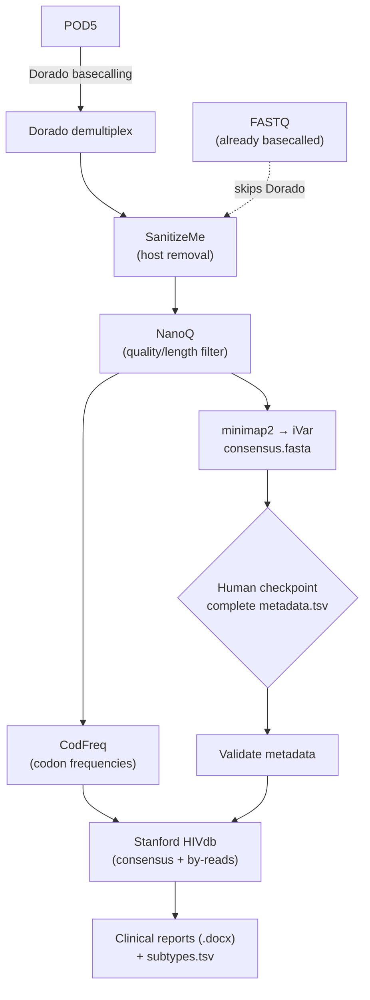

# NanoHIV-DR: Nanopore HIV Drug Resistance Analysis Pipeline

## Introduction

NanoHIV-DR is a Nextflow pipeline for detecting HIV-1 drug resistance from Oxford Nanopore sequencing of the *pol* gene. It takes raw POD5 signal (or basecalled FASTQ), performs quality control, reference-guided alignment and depth-aware consensus calling, queries the Stanford HIVdb for drug-resistance interpretation, and generates per-sample clinical reports. The whole workflow runs inside a Docker container for reproducibility.

## Overview

The pipeline runs in **two stages**.

**Stage 1 — `consensus`** turns raw signal into consensus sequences and codon-frequency files:

1. Basecalling with **Dorado**
2. Barcode demultiplexing with **Dorado**
3. Host (human) read removal with **SanitizeMe**
4. Read quality/length filtering with **NanoQ**
5. Reference-guided alignment to **HXB2-pol** with **minimap2** (coordinate-sorted BAM/BAI)
6. Depth-aware majority consensus with **iVar** (defaults: min base quality 15, allele threshold 0.5, min depth 20; positions below min depth are masked to `N`)
7. Codon-frequency analysis with **CodFreq** (in parallel, from the filtered reads)

At the end of Stage 1 the pipeline pauses at a **human checkpoint**: it writes a combined `consensus.fasta` and a `metadata_template.tsv` for you to complete before reporting.

**Stage 2 — `report`** turns consensus sequences + completed metadata into interpreted reports:

8. Metadata/consensus identifier validation
9. Stanford **HIVdb** drug-resistance interpretation of the consensus sequences (SierraPy / sierra-client)
10. Stanford **HIVdb** by-reads interpretation of the CodFreq files
11. Subtype assignment and per-sample clinical reports (`.docx`)

## Workflow overview

The pipeline accepts **either** raw POD5 signal (which it basecalls and demultiplexes with Dorado) **or** already-basecalled FASTQ (which skips Dorado entirely). Both routes converge at host removal.



---

# Requirements

You only need two tools on the host; everything else (Dorado, minimap2, samtools, iVar, NanoQ, CodFreq, SierraPy, etc.) is installed inside the Docker image.

### 1. Docker

Install Docker Desktop: https://www.docker.com/products/docker-desktop/

```
docker --version
```

### 2. Nextflow

```
curl -s https://get.nextflow.io | bash
sudo mv nextflow /usr/local/bin/
```

---

# Installation

### Clone the repository

```
git clone https://github.com/Tully-Lab/NanoHIV-DR.git
cd NanoHIV-DR
```

### Build the Docker image

The image is built for `linux/amd64` because Dorado ships an x86_64 binary. The Dorado binary is **downloaded during the build** (pinned via the `DORADO_VERSION` build argument in the `Dockerfile`) — it is no longer shipped in the repository. From the `NanoHIV-DR` directory:

```
docker buildx build \
  --platform linux/amd64 \
  -t nanohiv-dr-cpu:latest \
  --load .
```

To build against a specific Dorado version:

```
docker buildx build \
  --platform linux/amd64 \
  --build-arg DORADO_VERSION=1.3.0 \
  -t nanohiv-dr-cpu:latest \
  --load .
```

Verify the image:

```
docker image inspect nanohiv-dr-cpu:latest --format '{{.Os}}/{{.Architecture}}'
docker images | grep nanohiv
```

Expected: `nanohiv-dr-cpu   latest`. The `nextflow.config` already enables Docker and sets this image, so you do **not** need to pass `-with-docker` on the command line.

### Note on institutional logos

`logoUVRI.png` and `logoCVR.png` can be replaced with your own institutional images to customise the clinical reports.

---

# Required reference data

Two large inputs are **not** included in the repository and must be provided once. The small HIV references (`HXB2-pol` and its index, `HIV1.json`) are already included under `references/HIV/`.

### 1. Human reference genome (for host removal)

Download the human reference and place it at `references/Human/human_g1k_v37.fasta`:

```
mkdir -p references/Human
wget -O references/Human/human_g1k_v37.fasta.gz \
  ftp://ftp-trace.ncbi.nih.gov/1000genomes/ftp/technical/reference/human_g1k_v37.fasta.gz
gunzip references/Human/human_g1k_v37.fasta.gz
```

(See also https://github.com/jiangweiyao/SanitizeMe.)

### 2. Dorado basecalling model

Download the model you want with Dorado and pass its path via `--dorado_model`:

```
dorado download --model dna_r10.4.1_e8.2_400bps_sup@v5.2.0
```

This creates a model **directory** in the current folder; `--dorado_model` must point at that directory (not a bare model name).

### Test data

`data/pod5/filtered.pod5` is a small POD5 file (filtered from a larger run) included so you can do a quick end-to-end test.

---

# Running NanoHIV-DR

## Stage 1 — consensus

Provide the directory of POD5 files:

```
nextflow run main.nf \
    --stage consensus \
    --pod5 data/pod5 \
    --outdir results \
    --dorado_model "$PWD/dna_r10.4.1_e8.2_400bps_sup@v5.2.0"
```

Alternatively, if your reads are **already basecalled**, skip Dorado and supply FASTQ instead (exactly one of `--pod5` or `--fastq` must be given):

```
nextflow run main.nf \
    --stage consensus \
    --fastq 'data/*.fastq' \
    --outdir results
```

When Stage 1 finishes it writes, in `results/05_consensus/`:

- `consensus.fasta` — combined consensus sequences
- `consensus_manifest.tsv`
- `metadata_template.tsv` — one row per sample, ready to complete

## Complete the metadata

Open `results/05_consensus/metadata_template.tsv`, fill in the sample information, and pass your completed file to `--metadata` in Stage 2 — it can keep any filename, there is no need to rename it. For a quick check you can even pass the unedited template directly, since only the `sample_id` column is validated. It has these columns:

| Column | Notes |
| --- | --- |
| `sample_id` | **Do not change.** Must exactly match the consensus FASTA headers (e.g. `barcode07`). This is the key used to match reports to sequences. |
| `patient_id` | Your patient/sample identifier |
| `age` | Optional |
| `sex` | Optional |
| `date` | Optional |

Stage 2 will **stop** if the `sample_id` values in the metadata do not exactly match the identifiers in the consensus FASTA.

## Stage 2 — report

```
nextflow run main.nf \
    --stage report \
    --consensus results/05_consensus/consensus.fasta \
    --metadata metadata.tsv \
    --outdir results
```

Stage 2 writes the Stanford HIVdb analyses under `results/08_hivdb/` and the final outputs under `results/09_reports/` — per-sample clinical reports (`.docx`), a subtype table (`subtypes.tsv`), and copies of the HIVdb JSON results.

### CAUTION

Care should be taken to maintain confidentiality: clinical reports may contain several pieces of information that, combined, could identify an individual.

---

# Output layout

```
results/
├── 01_basecalled/     Dorado basecalled reads
├── 02_demultiplexed/  Dorado demultiplexed reads
├── 03_removehost/     SanitizeMe (host-removed reads)
├── 04_nanoq/          NanoQ quality/length-filtered reads
├── 05_consensus/      iVar consensus, consensus.fasta, metadata_template.tsv
├── 06_minimap2/       minimap2 alignments (BAM/BAI)
├── 07_codfreq/        CodFreq codon-frequency files
├── 08_hivdb/          Stanford HIVdb JSON (consensus/ and reads/)
└── 09_reports/        Clinical reports (.docx), subtypes.tsv, HIVdb JSON
```

---

# Key parameters

| Parameter | Default | Description |
| --- | --- | --- |
| `--stage` | *(required)* | `consensus` (Stage 1) or `report` (Stage 2) |
| `--pod5` | – | Directory of POD5 files (Stage 1) |
| `--fastq` | – | Basecalled FASTQ input, alternative to `--pod5` |
| `--consensus` | – | Consensus FASTA (Stage 2) |
| `--metadata` | – | Completed metadata TSV (Stage 2) |
| `--outdir` | `results` | Output directory |
| `--dorado_model` | `dna_r10.4.1_e8.2_400bps_sup@v5.2.0` | Path to the downloaded Dorado model directory |
| `--kit_name` | `SQK-NBD114-96` | Nanopore barcoding kit |
| `--min_quality` / `--min_length` / `--max_length` | 15 / 800 / 1200 | NanoQ read filtering |
| `--ivar_min_quality` / `--ivar_threshold` / `--ivar_min_depth` | 15 / 0.5 / 20 | iVar consensus settings |
| `--threads` | 8 | Default CPU allocation for threaded processes |

For help:

```
nextflow run main.nf --help
```

---

# Testing

A ready-to-run test dataset is **included in the repository**: `data/pod5/filtered.pod5`, a small POD5 signal file filtered from a larger run. You can verify a working installation without supplying any of your own data.

Both test routes below need two one-time prerequisites (see **Requirements** and **Required reference data**):

1. the Docker image built — `docker buildx build --platform linux/amd64 -t nanohiv-dr-cpu:latest --load .`
2. the human reference genome at `references/Human/human_g1k_v37.fasta` (used for host removal).

## Quick test (recommended)

The simplest end-to-end check uses the **bundled example data** in `data/example/` — a subset of two public samples from DDBJ BioProject **PRJDB17699** (near-full-length reads covering PR, RT and integrase). It runs through `--fastq`, so it needs **no Dorado model** and **no download**; just the two prerequisites above (Docker image + human genome). One command:

```
nextflow run main.nf -profile test
```

(The bundled files are subsampled to keep the repository light. To pull the full-size data, or other accessions, use `bin/fetch_test_data.sh` — which needs the SRA toolkit: `conda install -c bioconda sra-tools` — and it downloads into `data/test/`.)

Expected result: Stage 1 finishes and writes `results_test/05_consensus/consensus.fasta` (one sequence per sample) and `metadata_template.tsv`, with per-sample outputs under `results_test/01_basecalled/` … `07_codfreq/`. Any sample that failed is listed in `results_test/05_consensus/failed_samples.txt` (see **Failed or missing samples**).

To then generate the clinical reports:

```
nextflow run main.nf --stage report \
    --consensus results_test/05_consensus/consensus.fasta \
    --metadata results_test/05_consensus/metadata_template.tsv \
    --outdir results_test
```

This writes per-sample reports to `results_test/09_reports/`.

## Offline test with the bundled POD5

The included `data/pod5/filtered.pod5` exercises the **full signal path, including Dorado basecalling**, and therefore additionally needs a downloaded Dorado model (see **Required reference data**):

```
nextflow run main.nf \
    --stage consensus \
    --pod5 data/pod5 \
    --outdir results_smoke \
    --dorado_model "$PWD/dna_r10.4.1_e8.2_400bps_sup@v5.2.0"
```

Expected result: `results_smoke/05_consensus/consensus.fasta` is produced. Follow it with the same Stage 2 command as above (pointing `--consensus`/`--outdir` at `results_smoke`) to produce reports.

# Resuming interrupted runs

Nextflow caches completed processes. Add `-resume` to continue without repeating finished work (its position on the command line does not matter):

```
nextflow run main.nf --stage consensus --pod5 data/pod5 --outdir results -resume
```

---

# Troubleshooting

## Failed or missing samples

Stage 1 processes use a retry-then-skip policy: a transient failure is retried (up to `--max_retries`, default 2), and a sample that still fails is skipped so the rest of the batch completes. Skipped samples are otherwise dropped silently by Nextflow, so the consensus checkpoint **explicitly accounts for them**: it compares the samples submitted for analysis against those that produced a consensus, prints a prominent `WARNING` listing any that failed, and writes the list to `results/05_consensus/failed_samples.txt` (empty if none). Always check that file (and the execution report / `trace-*.txt`) before treating a run as complete. Set `--max_retries 0` to disable retries.

## Docker platform warning on Apple Silicon

The image is built for `linux/amd64` because Dorado is an x86_64 binary. On an Apple Silicon Mac (M1/M2/M3/M4) Docker runs it under emulation and may print:

```
WARNING: The requested image's platform (linux/amd64) does not match the detected host platform (linux/arm64/v8)
```

This warning is expected and does not stop the pipeline.

---

# Acknowledgement

We appreciate the contribution of Samantha Campbell, whose workflow (https://github.com/centre-for-virus-research/UVRI-HIV-diagnostic-report) was used with minor modifications for the clinical report generation. The pipeline was developed in collaboration with the Medical Research Council (MRC) Centre for Virus Research (CVR), Glasgow, to suit the needs of the Uganda Virus Research Institute (UVRI).

# Citation

If you use NanoHIV-DR in research, please cite: Daniel Lule Bugembe, Deogratius Ssemwanga, Pontiano Kaleebu & Damien C. Tully. *NanoHIV-DR: An end-to-end workflow for the detection of HIV-1 drug resistance of pol-gene Oxford Nanopore sequences.* (Draft, 2026)

# Contact

Before opening a new issue, please check the existing issues to see whether it has already been reported.

- 🐛 [Report a bug](https://github.com/Tully-Lab/NanoHIV-DR/issues/new?template=bug_report.md)
- 💡 [Request a feature](https://github.com/Tully-Lab/NanoHIV-DR/issues/new?template=feature_request.md)
- 🔎 [View existing issues](https://github.com/Tully-Lab/NanoHIV-DR/issues)
